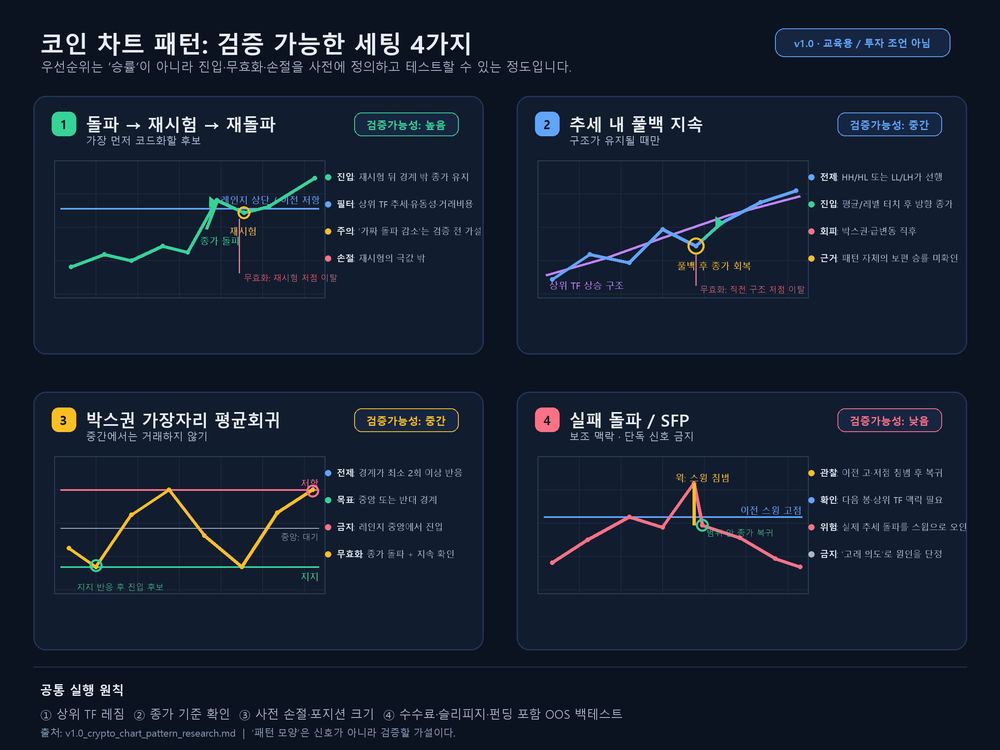

# v1.0 코인 투자 참고용 차트 패턴 리서치

> **기준 시각:** 2026-08-22 20:07 (로컬)  
> **목적:** 유동성이 충분한 BTC·ETH 중심 현물/선물 시장에서, “그럴듯해 보이는 모양”이 아니라 **명확히 정의·백테스트·리스크 관리가 가능한 패턴**을 선별하기 위한 교육용 기준. 투자 조언이나 수익 보장이 아니다.

## 결론 먼저

1. **보편적으로 높은 고정 승률을 가진 패턴은 확인되지 않았다.** 암호화폐에서 검증된 연구는 주로 이동평균 등 *완전히 규칙화된 기술 규칙*을 다루며, 헤드앤숄더·Wyckoff·SFP처럼 주관적 해석이 큰 도형의 보편 승률을 입증하지 않는다.
2. 따라서 아래 우선순위는 **수익률/승률 순위가 아니라, 객관성·조건 명확성·검증 가능성 순위**다. 실전 성과는 자산·시간대·레짐·수수료·슬리피지·펀딩을 넣어 별도 백테스트해야 한다.
3. 가장 먼저 검증할 후보는 **추세 방향의 돌파-재시험**, **추세 내 풀백 지속**, **명확한 박스권의 평균회귀**다. 이들은 진입·무효화·손익비를 사전에 고정하기 쉽다. 고전 반전 도형과 “유동성 스윕/스마트머니”는 보조 맥락으로만 쓰고 단독 신호로는 채택하지 않는다.

## 시각 가이드

- [원본 PNG 열기](assets/v1.0_chart_patterns_visual_guide.png)
- 그림의 순위는 **검증 가능성** 기준이며, 특정 패턴의 승률 또는 투자 신호를 뜻하지 않는다.

---

## 1. 조사 방식과 신뢰도 규칙

### Gemini 수집 → GPT 분류 → Claude 검토 흐름

- **Gemini 2.5 Flash + Google Search grounding:** 실증연구, 고전 패턴, 돌파/거래량, 반전/박스권, 리스크 프레임, 주요 크립토 교육자 등 6개 독립 질의를 병렬 수행했다. 원문은 `v1.0_crypto_chart_patterns_gemini_research_raw.json`, 재실행 수집기는 `query_gemini_crypto_patterns.py`에 보관했다(활성 Gemini API 권한 필요).
- **GPT 정리:** 논문 제목·DOI·초록은 Crossref/OpenAlex로 대조하고, Gemini가 반환한 오래된/깨진 링크·비정상적으로 긴 URL·고정 승률 주장은 근거에서 제외했다.
- **자료 유형:** A=동료심사 실증연구, B=공식 교육자료(개념), C=교육자 개인 프레임, D=사후 해석·판매성 승률 주장.
- **검증 상태:** `초록 대조`=서지·초록을 외부 인덱스로 확인, `원문 재현 전`=본문 규칙/비용/코드를 재현하지 않음. 자료 유형과 검증 상태는 별개다.

### 해석 시 금지할 것

- 서로 다른 자산·시간대·청산 규칙의 **승률만** 비교하기
- 현물 백테스트를 선물에 그대로 적용하기(펀딩·청산·스프레드 누락)
- “거래량 동반”, “스윕”, “건강한 리테스트”처럼 모호한 표현을 수치화하지 않기
- 특정 인플루언서의 성공 차트만 모아 엣지로 간주하기

---

## 2. 실증 근거: 무엇까지 말할 수 있나

| 근거 | 확인된 범위 | 이 리서치에서의 해석 | 자료 유형 / 검증 상태 |
|---|---|---|---|
| 11개 주요 암호화폐 일별 가격(2016–2018)에서 20일 변동 이동평균 규칙을 시험한 연구 | 대조한 초록은 BTC 제외 시 20일 이동평균 규칙이 평균 시장수익 통제 후 연 8.76% 초과수익을 보고한다. 약 2~3년의 한 사이클 표본이며, 벤치마크·비용·규칙 세부와 다중검정 보정은 원문 재현 전에는 확정하지 않는다.[1] | “완전 규칙화된 추세 규칙은 일부 표본에서 엣지가 있었음”의 참고 근거다. **차트 도형 일반의 승률** 근거는 아니다. | A / 초록 대조, 원문 재현 전 |
| BTC에 124개 기술지표를 적용한 연구 | 좁은 일간 수익 구간에서 강한 표본외 예측력을 보고했다.[3] | 단일 패턴보다 조건/변수 결합이 중요할 수 있다는 신호다. 모델 복잡도와 과적합 위험은 별도 관리해야 한다. | A / 초록 대조, 원문 재현 전 |
| Lo·Mamaysky·Wang의 자동 차트 패턴 인식 연구 | 1962–1996 미국 주식에서 헤드앤숄더·더블바텀 등 일부 지표가 조건부 수익분포에 추가 정보를 줄 수 있음을 보고했다.[4] | 크립토로 직접 전이할 수 없다. 다만 **패턴을 알고리즘으로 정의해야 검증 가능**하다는 방법론 근거로 쓴다. | A / 초록 대조, 원문 재현 전 |
| 크립토 트레이딩 연구 146편을 훑은 survey | 데이터·신호·위험관리 등 다양한 연구 결과가 있으나, 시장 특성과 방법론이 이질적임을 정리한다.[5] | 하나의 ‘최고 패턴’보다 레짐·거래비용·검증 설계가 핵심이라는 결론을 지지한다. | A / 초록 대조 |
| BTC 기술 규칙 수익성 연구 | BTC에서 기술 규칙의 수익성을 다룬 동료심사 논문이다.[2] | 초록/원문 규칙을 직접 재현하기 전에는 이 문서에서 수치 주장에 사용하지 않는다. | A / 서지 대조, 원문 재현 전 |

**핵심:** 현재 검증 가능한 근거는 ‘룰 기반 기술분석이 특정 표본에서 유효할 수 있다’까지다. **돌파-재시험·깃발·컵앤핸들·SFP 가운데 무엇이 절대적으로 승률이 높다**는 결론은 이 조사로 낼 수 없다.

---

## 3. 채택 우선순위: “승률” 대신 검증 가능한 세팅 순위

| 우선 | 세팅 | 왜 우선인가 | 최소 객관 규칙 예시 | 사용하면 안 되는 상황 | 증거 상태 |
|---:|---|---|---|---|---|
| 1 | **상위 추세 방향의 돌파 → 재시험 → 재돌파** | 진입·무효화가 레벨 기반이라 사전 정의가 쉽다. 재시험이 가짜 돌파 노출을 낮춘다는 점은 **검증 전 실무 가설**이며, 별도 시험 대상이다. | 상위 TF(예: 일봉) 추세와 같은 방향; 최소 N개 봉이 확인한 레인지 경계의 종가 돌파; 경계 재시험 뒤 종가 유지; 손절은 재시험 저점/고점 밖. | 레인지 중앙, 거래량·유동성이 얇은 알트, 고변동 이벤트 직전. | B/C. 거래소 교육자료는 개념 설명용이며 성과 우위·공통 승률 근거가 아니다.[6][7] |
| 2 | **추세 내 풀백 지속(continuation pullback)** | 이동평균·스윙 저점/고점으로 규칙화하기 쉽고, 1번과 조합할 수 있다. | 상위 TF HH/HL 또는 LL/LH; 가격이 기준 평균/직전 돌파 레벨까지 되돌림; 추세 방향 종가 회복 시 진입; 직전 구조 저점/고점 이탈 시 무효. | 추세 정의가 불명확한 박스권, 급등·급락 직후 확장 변동성. | C. 이동평균 연구는 방향성 참고일 뿐, 이 재량 세팅의 직접 근거가 아니다. |
| 3 | **명확한 박스권 가장자리 평균회귀** | 레인지 상·하단, 손절, 목표(중앙/반대 경계)를 사전 고정할 수 있다. | 경계가 최소 2회 이상 반응, 레인지 폭이 거래비용 대비 충분, 중간이 아닌 가장자리에서만 반전 캔들/실패 돌파 확인 후 진입. | 범위가 막 형성됐거나, 돌파 거래량·종가가 강한 순간. | C. 전략은 직관적이나 공통 재현 승률 미확인. |
| 4 | **실패 돌파 / 스윙 실패(SFP) 후 범위 복귀** | 손절 위치가 스윕 고점/저점 밖으로 분명할 수 있다. 다만 ‘스탑 헌팅’ 서사는 과도하게 해석되기 쉽다. | 이전 스윙을 침범한 뒤 같은 TF에서 범위 안 종가 복귀; 다음 봉 확인; 손절은 스윕 극값 밖. | 강한 추세 돌파 초입(실패 돌파로 오인하기 쉬움). | C/D. 구조는 테스트 가능하지만 ‘고래가 스탑을 사냥했다’는 원인 주장은 검증 불가. |
| 5 | **더블탑/더블바텀·H&S·삼각수렴·플래그** | 교육과 커뮤니케이션에는 유용하지만 인식 규칙이 주관적이다. | 넥라인/경계 돌파 **종가**와 무효화 레벨을 수치화한 경우에만 테스트 대상. | 모양이 완성되기 전 예측 진입, 대칭성·거래량을 사후 해석하는 경우. | B/C. 자동 인식 연구는 존재하지만 크립토의 범용 승률 미확인.[4] |
| 6 | **Wyckoff·Elliott Wave·SMC/ICT 내러티브** | 시장 구조를 읽는 언어로는 쓸 수 있으나, 동일 차트에 여러 카운트/단계가 가능하다. | 규칙을 코드 수준으로 강제할 수 있을 때만 별도 실험. | ‘Composite Man/기관 매집’ 등 의도 추정만으로 매매할 때. | D. 보편적 재현 수치 미확인. |

### 실제 우선 추천안

- **학습/도입:** 1번 → 2번 → 3번 순서. 세팅 하나만 선택하고 최소 100개 이상의 관측을 모은다.
- **실전:** 1번 단독이 아니라 **상위 추세 + 레벨 + 종가 확인 + 손절 거리 + 유동성**의 체크리스트로 취급한다.
- **보류:** 도형이 예쁘다는 이유만으로 4~6번을 높은 확률 패턴으로 분류하지 않는다.

---

## 4. 주요 트레이더·인플루언서 자료: 취합 결과와 사용 원칙

Gemini는 Rekt Capital, CryptoCred, DonAlt, TraderSZ, Cheds, TheChartGuys, Scott Melker를 수집 후보로 제시했다. 다만 이번 원자료 검증에서는 특정 Substack/X 링크가 404였고, 일부 YouTube/플레이리스트 URL은 저자·제목을 독립 확인하지 못했거나 비정상적이었다. 따라서 아래 표는 **교육자별 매매법 요약이 아니라 원자료 감사 결과**다.

| 수집 후보 | 원자료 검증 결과 | 이번 문서에서의 사용 |
|---|---|---|
| Rekt Capital | 공식 도메인은 접근 가능했으나 Gemini가 제시한 특정 글은 404였다.[9] | 구체적 프레임·문구·성과 주장에서 제외 |
| CryptoCred | 제시된 영상 URL의 저자·제목을 독립 확인하지 못했다. | 제외 |
| DonAlt | 제시된 X 게시물이 404였다. | 제외 |
| TraderSZ | 제시된 원자료의 정체를 확인하지 못했다. | 제외 |
| Cheds | 독립 원자료 URL을 확보하지 못했다. | 제외 |
| TheChartGuys | 제시된 플레이리스트 URL이 비정상적이었다. | 제외 |
| Scott Melker | 독립 원자료 URL을 확보하지 못했다. | 제외 |

**중요한 결론:** 인플루언서는 향후 검증할 가설을 얻는 아이디어 소스일 뿐, **패턴 승률의 독립 근거가 아니다.** 유료방/스크린샷/사후 분석을 성과 증명으로 쓰지 않는다. 다음 조사에서는 각 교육자의 본인 도메인·공식 채널 원본, 발행일, 사전 정의된 규칙과 공개 검증을 모두 확보한 경우에만 인용한다.

---

## 5. 패턴별 실행 체크리스트

### A. 돌파-재시험

- [ ] BTC/ETH 등 충분한 현물·선물 유동성인가? 유동성이 낮으면 가격 신호가 큰 주문에 왜곡될 수 있다(거래소 교육자료의 개념 설명).[8]
- [ ] 상위 시간대 추세와 동일 방향인가?
- [ ] 경계는 최소 두 차례 반응했으며, 봉 **종가**가 경계를 넘었는가?
- [ ] 재시험이 경계 밖에서 유지됐는가? 실패 시 무효화 레벨은 재시험 극값인가?
- [ ] 추격 진입 시 손절까지의 거리를 기준으로 포지션 크기를 줄였는가?

### B. 추세 풀백

- [ ] 추세 정의(HH/HL 또는 LL/LH, 혹은 사전 지정 평균)가 먼저 존재하는가?
- [ ] 풀백이 이전 구조를 깨지 않았는가?
- [ ] 반전은 ‘느낌’이 아닌 종가·스윙 회복으로 정의됐는가?
- [ ] 목표가 이전 고점/저점과 최소 손익비를 충족하는가?

### C. 박스권 평균회귀

- [ ] 경계·중앙·반대 경계를 숫자로 미리 적었는가?
- [ ] 중간 가격에서는 거래하지 않는가?
- [ ] 돌파 시 즉시 전략을 중단할 무효화 규칙이 있는가?
- [ ] 거래비용과 펀딩을 반영해도 목표 폭이 남는가?

---

## 6. ‘승률이 높다’를 검증하는 최소 프로토콜

패턴별 비교는 아래가 동일할 때만 의미가 있다.

1. **자산/기간:** BTCUSDT·ETHUSDT부터 시작하고, 상승·하락·횡보 구간을 모두 포함한다.
2. **시간대:** 예: 일봉에서 레짐, 4시간봉에서 진입처럼 고정한다.
3. **정의:** ‘돌파’는 `종가 > N봉 최고가`, ‘재시험’은 허용 오차·관찰 봉 수까지 코드로 쓴다.
4. **매매 규칙:** 진입, 손절, 부분익절/트레일링, 시간 청산을 사전에 고정한다.
5. **비용:** 거래 수수료, 스프레드/슬리피지, 선물 펀딩, 레버리지 청산 위험을 포함한다.
6. **평가:** 승률 외에 평균 이익 R, 평균 손실 R, 기대값 `E = p×평균이익R − (1−p)×평균손실R`, 최대낙폭, 표본 수를 같이 본다.
7. **검증:** 설계 기간(in-sample)과 보류 기간(out-of-sample)을 분리하고, 자산·시기별 결과가 유지되는지 확인한다.

> **통과 기준 제안:** 100회는 최소 하한일 뿐 충분조건이 아니다. 100회 이상 신호, 비용 포함 양(+) 기대값, OOS에서도 양(+) 기대값, 한 레짐에만 의존하지 않음과 함께, 기대값의 신뢰구간/부트스트랩 결과를 확인한다. 이 조건을 충족하기 전에는 ‘우수 패턴’이 아니라 **관찰 가설**로 표기한다.

---

## 7. Coinmirror 적용 제안

매수·매도 추천이 아닌 행동 회고 제품 방향에 맞춰, 이 리서치는 다음 기능의 기준으로 쓰는 편이 안전하다.

- 거래 직후 “선택한 세팅(돌파-재시험/풀백/박스권)”, 상위 TF 추세, 손절 계획 유무를 기록한다.
- 표본이 30건 미만이면 기대값/승률 수치를 표시하지 않고, 100건 미만은 **탐색 표본**으로만 표기한다. 이는 통계적으로 도출된 임계값이 아닌 보수적 제품 운영 규칙이다. 100건 이상도 기대값·신뢰구간·계획 준수율·추격 진입 비중을 함께 보여준다.
- 앱 표현은 “이 패턴의 승률은 X%”가 아니라, “당신의 정의로 기록한 N건에서 비용 포함 기대값은 Y R(불확실성 범위 포함)”로 제한한다.
- SMC/Wyckoff/인플루언서 시그널은 설명 태그로만 제공하고, 추천·자동매매 신호로 격상하지 않는다.
- 고지문에는 투자 조언 아님, 원금 손실·레버리지 청산 위험, 과거 기록의 미래 수익 비보장, 백테스트 과적합/사후편향 위험을 포함한다. 패턴 태그가 투자추천으로 오인되지 않도록 국내 가상자산이용자보호법 및 유사투자자문업 해당 여부는 출시 전 법률 검토한다.

---

## 현재 상태 / 다음 액션

- **완료:** Gemini 광역 수집, 학술 메타데이터 대조, 패턴 분류 초안, 인플루언서 원자료 검증 필터.
- **결정:** 공통 승률 랭킹은 만들지 않고, `검증 가능한 세팅 랭킹`으로 대체한다.
- **다음 액션:** BTC·ETH 4시간봉으로 1~3번 세팅을 코드화해 비용 포함 OOS 백테스트를 수행하면, 그때 실제 승률·R 기대값 순위를 추가할 수 있다.

## Sources

[1] https://doi.org/10.1016/j.frl.2019.101396
[2] https://doi.org/10.1016/j.frl.2019.08.011
[3] https://doi.org/10.1016/j.jfds.2018.10.001
[4] https://www.nber.org/papers/w7613
[5] https://doi.org/10.1186/s40854-021-00321-6
[6] https://academy.binance.com/en/articles/what-is-breakout-trading
[7] https://academy.binance.com/en/articles/what-are-volume-indicators
[8] https://www.binance.com/en/academy/articles/what-is-liquidity
[9] https://www.rektcapital.com
